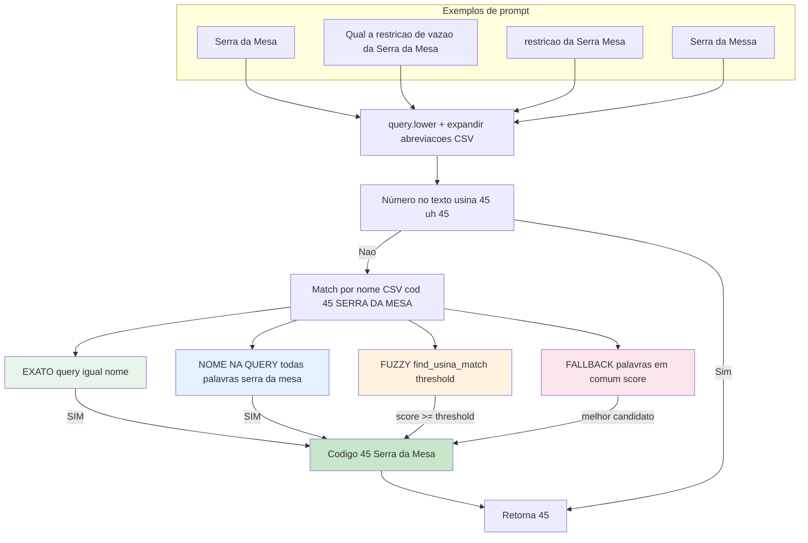
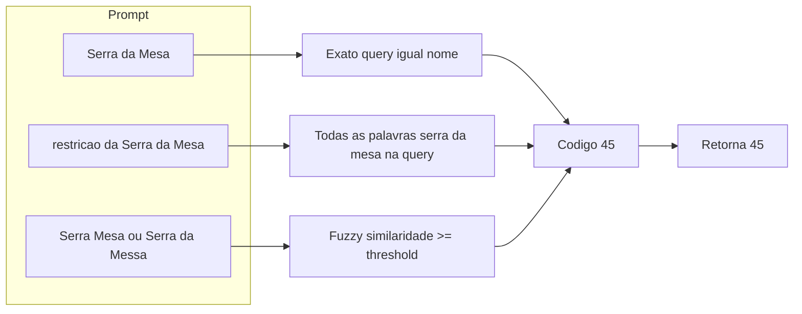

# Fluxo: matching de código de usina a partir do nome no prompt

Este documento descreve como o matcher identifica o código da usina quando o usuário escreve o **nome** da usina no prompt, com exemplo real (Serra da Mesa, código 45). Os matchers thermal e hydro seguem a mesma lógica; a diferença está na fonte dos códigos/nomes (deck+CSV vs CSV).

---

## Dados de exemplo (CSV hidro)

| codigo | nome_decomp   | nome_completo  |
|--------|----------------|----------------|
| 45     | SERRA DA MESA  | Serra da Mesa  |

---

## Os três caminhos até o código (por nome)

| Tipo de match     | Exemplo de prompt                              | Como identifica o código 45 |
|-------------------|------------------------------------------------|-----------------------------|
| **Exato**         | `"Serra da Mesa"`                              | query == "serra da mesa" |
| **Todas palavras**| `"Qual a restrição de vazão da Serra da Mesa?"` | "serra", "da", "mesa" presentes na query |
| **Fuzzy**         | `"restrição da Serra Mesa"` ou `"Serra da Messa"` | similaridade com "Serra da Mesa" acima do threshold |

---

## Diagrama Mermaid (fluxo completo)

Para compatibilidade com viewers: evite aspas duplas dentro de labels; use arestas separadas em vez de `P1 & P2 --> X`; use apenas ASCII em labels de aresta (ex.: `->` em vez de `→`, `>=` em vez de `≥`).

---

## Diagrama Mermaid (versão resumida)

---

## Referências no código

- **Hydro (hidrelétricas):** `backend/decomp/utils/hydraulic_plant_matcher.py` — `_extract_by_name()` (match exato, word boundary/todas palavras, fuzzy, fallback).
- **Thermal (térmicas):** `backend/decomp/utils/thermal_plant_matcher.py` — `_extract_by_name()` (mesma ideia; fonte deck+CSV).
- **Matcher centralizado (fuzzy):** `backend/core/utils/usina_name_matcher.py` — `find_usina_match()`.
